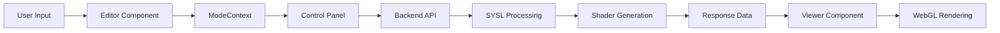

# Agent Documentation: MPSPY Shader Visualization Platform

## Table of Contents
1. [Overview](#overview)
2. [Architecture](#architecture)
3. [Data Pipeline](#data-pipeline)
4. [Component Structure](#component-structure)
5. [Design Decisions & Consistency Rules](#design-decisions--consistency-rules)
6. [Backend Integration](#backend-integration)
7. [Development Guidelines](#development-guidelines)
8. [Common Patterns](#common-patterns)
9. [Troubleshooting Guide](#troubleshooting-guide)

---

## Overview

The MPSPY Shader Visualization Platform is a **modular React-based frontend** with a **Flask backend** designed for **interactive shader development and visualization**. The system enables users to:

- Create shader code through **node-based editors** (Rete.js) or **code editors** (Monaco)
- Visualize shaders in **real-time** using **TWGL.js** or **iframe-based viewers**
- Control **uniform variables** through **dynamic UI controls**
- Switch between different **modes** with distinct editor/viewer/control combinations

### Key Technologies
- **Frontend**: React 18, TypeScript, Vite, Styled Components, Ant Design
- **Visualization**: TWGL.js, WebGL, HTML5 Canvas
- **Editors**: Rete.js (node editor), Monaco Editor (code editor)
- **Backend**: Flask, Python, SYSL (Shader Language)
- **Communication**: Axios, REST APIs, JSON

---

## Architecture

### 🏗️ Modular Mode-Based Architecture

The application follows a **clean separation of concerns** where each "mode" consists of three independent components:

```typescript
interface CleanAsmblrMode {
  name: string;
  label: string;
  editor: ModeEditor;        // Node editor OR code editor
  viewer: ModeViewer;        // Shader viewer OR iframe viewer  
  controlPanel: ModeControlPanel; // Mode-specific controls
}
```

### 🔄 Component Hierarchy

```
EnhancedApp
├── SettingsProvider (Global settings)
├── ModeProvider (Mode-specific data flow)
└── EnhancedModularLayout
    ├── EnhancedHeader (Navigation, mode picker)
    ├── ResizableLayout (Draggable panels)
    │   ├── AdaptiveEditor (Dynamic editor switching)
    │   ├── AdaptiveViewer (Dynamic viewer switching)  
    │   └── HybridControlPanel (Mode controls)
    └── SettingsDialog (Configuration UI)
```

### 🎯 Context-Driven Data Flow

**Two primary React Contexts** manage application state:

1. **`SettingsContext`**: Global UI settings, component selection, shader parameters
2. **`ModeContext`**: Mode-specific data (shader code, uniforms, HTML content)

---

## Data Pipeline

### 📊 End-to-End Data Flow



### 🔄 Data Transformation Steps

#### 1. **Editor → Backend**
```typescript
// Node Editor: Extract serializable module data
const moduleData = editor.modules?.list || editor.list || [];

// Code Editor: Send raw Python code
const codeData = editor.getCode();

// API Payload
const payload = {
  moduleData,
  shaderSettings: settings.shaderGeneration.shaderSettings
};
```

#### 2. **Backend Processing**
```python
# Flask endpoint processes the request
@app.route('/sysl-generate-twgl-shader', methods=['POST'])
def apicall_sysl_twgl():
    # Extract and merge settings
    shader_settings = merge_shader_settings(request_data)
    
    # Generate shader using SYSL
    shader_code, uniforms, textures = evaluate_to_shader(expr, settings)
    
    return {
        "shaderCode": shader_code,
        "uniforms": uniforms,
        "textures": textures
    }
```

#### 3. **Frontend Rendering**
```typescript
// Viewer receives processed data
const { shaderCode, uniforms, textures } = await generateTWGLShaderCode(payload);

// Load into appropriate viewer
if (selectedViewer === 'shader_viewer') {
  viewerRef.current.loadShaderCode({ shaderCode, uniforms, textures });
} else {
  viewerRef.current.loadHTML(html);
}
```

### 🔗 Context Data Flow

#### **ModeContext Data Structure**
```typescript
interface ModeData {
  shaderCode?: string;           // Generated GLSL code
  uniforms?: Record<string, any>; // Uniform variables
  nodeGraph?: any;               // Rete.js graph data
  htmlContent?: string;          // Generated HTML
  viewerMode?: 'shader' | 'iframe'; // Viewer type
}
```

#### **Settings Context Structure**
```typescript
interface SettingsState {
  ui: {
    theme: 'light' | 'dark';
    layout: LayoutSettings;      // Panel visibility/sizing
    components: {
      selectedEditor: 'rete_node_editor' | 'code_editor';
      selectedViewer: 'iframe_viewer' | 'shader_viewer';
    };
  };
  shaderGeneration: {
    shaderSettings: ShaderSettings; // SYSL parameters
  };
}
```

---

## Component Structure

### 📁 Directory Organization

```
src/
├── components/
│   ├── control-panel/     # Control panels for different modes
│   ├── editors/          # Editor components (adaptive, code, node)
│   ├── header/           # Navigation and mode selection
│   ├── layout/           # Layout and resizing components
│   ├── utils/            # Utility components and helpers
│   └── visualizer/       # Viewer components (iframe, shader, adaptive)
├── design/               # Centralized styling and theme
├── modes/                # Mode definitions and context
├── store/                # React contexts and state management
└── types/                # TypeScript type definitions
```

### 🧩 Key Component Categories

#### **1. Adaptive Components**
**Purpose**: Dynamic component switching based on user settings

```typescript
// AdaptiveEditor: Switches between Rete.js and Monaco
const useAdaptiveEditor = () => {
  const { selectedEditor } = useSettings();
  return selectedEditor === 'code_editor' ? CodeEditor : useEditor();
};

// AdaptiveViewer: Switches between Shader and Iframe viewers
const AdaptiveViewer = forwardRef((props, ref) => {
  const { selectedViewer } = useSettings();
  return selectedViewer === 'shader_viewer' ? 
    <ShaderVisViewer ref={ref} {...props} /> : 
    <HybridViewer ref={ref} {...props} />;
});
```

#### **2. Editor Components**

**Rete.js Node Editor** (`src/components/editors/rete_node_editor/`)
- **Node-based visual programming** for shader creation
- **Custom nodes**: Math, 3D operations, variables, combinators
- **Real-time preview** and **module system**
- **Import/export** functionality

**Monaco Code Editor** (`src/components/editors/CodeEditor.tsx`)
- **Python code editor** with syntax highlighting
- **IntelliSense, auto-completion, error detection**
- **Font size controls** and **professional editor features**

#### **3. Viewer Components**

**ShaderVisViewer** (`src/components/visualizer/ShaderVisViewer.tsx`)
- **TWGL.js-based WebGL rendering**
- **Dynamic uniform controls** (sliders, vectors, checkboxes)
- **Mouse controls** (orbit, pan, zoom)
- **Resizable canvas** controlled by resolution uniform
- **Vertical layout** with scrollable controls

**IFrameViewer** (`src/components/visualizer/IFrameViewer.tsx`)
- **HTML content rendering** in isolated iframe
- **URL and direct HTML loading**
- **Centered layout** with margins

#### **4. Control Panels**

**HybridControlPanel** (`src/components/control-panel/HybridControlPanel.tsx`)
- **Mode-agnostic control interface**
- **Dynamic API endpoint selection** based on viewer type
- **Shader generation** with loading states
- **Settings integration**

### 🎨 Styling Architecture

**Centralized Design System** (`src/design/`)
```typescript
// components.ts - Shared styled components
export const HeaderContainer = styled.div`
  display: flex;
  align-items: center;
  height: 56px;
  // ... consistent styling
`;

// theme.ts - Design tokens
export const theme = {
  colors: { /* ... */ },
  spacing: { /* ... */ },
  borderRadius: { /* ... */ }
};
```

---

## Design Decisions & Consistency Rules

### 🎯 Core Design Principles

#### **1. Modular Architecture**
- **Each mode** has independent `editor`, `viewer`, and `controlPanel`
- **Components are composable** and can be mixed/matched
- **Clear separation** between UI and business logic

#### **2. Context-Driven State Management**
- **No prop drilling** - use React Contexts for shared state
- **ModeContext** for mode-specific data flow
- **SettingsContext** for global configuration

#### **3. Adaptive Component Pattern**
```typescript
// ✅ CORRECT: Adaptive components that switch based on settings
const AdaptiveComponent = () => {
  const { selectedType } = useSettings();
  return selectedType === 'type_a' ? <ComponentA /> : <ComponentB />;
};

// ❌ INCORRECT: Hard-coded component selection
const FixedComponent = () => <ComponentA />; // Not flexible
```

#### **4. Consistent API Integration**
```typescript
// ✅ CORRECT: Centralized API with error handling
import { generateTWGLShaderCode } from '../API';
const response = await generateTWGLShaderCode(payload);

// ❌ INCORRECT: Direct axios calls scattered throughout
const response = await axios.post('/some-endpoint', data);
```

### 🔒 Consistency Rules

#### **Component Naming**
- **Adaptive components**: `Adaptive*` (e.g., `AdaptiveViewer`)
- **Mode-specific components**: `*ControlPanel`, `*Editor`, `*Viewer`
- **Styled components**: `PascalCase` (e.g., `HeaderContainer`)

#### **File Organization**
- **Group by feature**, not by type
- **Index files** for clean imports
- **Consistent directory structure**

#### **TypeScript Usage**
```typescript
// ✅ CORRECT: Explicit interfaces
interface ComponentProps {
  data: ShaderData;
  onUpdate: (data: ShaderData) => void;
}

// ✅ CORRECT: forwardRef with proper typing
const Component = forwardRef<ComponentHandle, ComponentProps>((props, ref) => {
  // implementation
});
```

#### **Event Handling Scope**
- **App level**: Only resize operations
- **Individual components**: Handle their own mouse events
- **Prevent event conflicts**: Use `stopPropagation()` appropriately

#### **Error Handling**
```typescript
// ✅ CORRECT: Centralized API error handling
try {
  const result = await apiCall();
  // handle success
} catch (error) {
  if (error instanceof APIError) {
    // handle API error
  }
  // handle other errors
}
```

### 🚫 Anti-Patterns to Avoid

#### **1. Direct DOM Manipulation**
```typescript
// ❌ INCORRECT
document.getElementById('some-element').style.color = 'red';

// ✅ CORRECT: Use React state and styled components
const [isActive, setIsActive] = useState(false);
<StyledComponent $isActive={isActive} />
```

#### **2. Circular Dependencies**
```typescript
// ❌ INCORRECT: Circular imports
// ComponentA imports ComponentB, ComponentB imports ComponentA

// ✅ CORRECT: Extract shared logic to separate module
// Create shared utility/context that both can use
```

#### **3. Mixed Responsibilities**
```typescript
// ❌ INCORRECT: Component doing too much
const BadComponent = () => {
  // API calls, state management, rendering, event handling all mixed
};

// ✅ CORRECT: Separate concerns
const GoodComponent = () => {
  const { data, actions } = useModeContext(); // State from context
  const handleClick = useCallback(() => { /* focused logic */ }, []);
  return <UI onAction={handleClick} />; // Clean render
};
```

---

## Backend Integration

### 🔌 API Architecture

**Centralized API Client** (`src/API.ts`)
```typescript
// Base configuration
const apiClient = axios.create({
  baseURL: 'http://127.0.0.1:5000',
  timeout: 30000,
  headers: { 'Content-Type': 'application/json' }
});

// Typed responses
interface ShaderCodeResponse {
  shaderCode: string;
  uniforms: Record<string, UniformSpec>;
  textures?: Record<string, any>;
}
```

### 📡 Key Endpoints

#### **Shader Generation**
- **`/sysl-generate-shader`**: Generate HTML for iframe viewer
- **`/sysl-generate-twgl-shader`**: Generate shader code + uniforms for TWGL viewer
- **`/api/test-html`**: Test endpoint for iframe functionality

#### **Request/Response Flow**
```typescript
// Frontend Request
const payload = {
  moduleData: extractedNodeData,
  shaderSettings: {
    render_mode: "v3",
    variables: { _AA: 2, castShadows: false },
    extract_vars: false,
    use_define_vars: true
  }
};

// Backend Response
{
  "shaderCode": "// Generated GLSL code...",
  "uniforms": {
    "size": { type: "vec3", init_value: [0.7, 0.7, 0.7], min: [0, 0, 0], max: [2, 2, 2] }
  },
  "textures": {}
}
```

### ⚙️ Backend Settings Integration

**Settings Merging Logic** (Python backend)
```python
def merge_shader_settings(request_data, default_settings):
    """Merge frontend settings with backend defaults"""
    shader_settings = request_data.get('shaderSettings', {})
    
    # Handle empty string values
    for key, value in shader_settings.items():
        if value == "":
            shader_settings[key] = default_settings.get(key)
    
    return {**default_settings, **shader_settings}
```

---

## Development Guidelines

### 🛠️ Adding New Components

#### **1. Create Adaptive Component**
```typescript
// 1. Add new type to settings
export type EditorType = 'rete_node_editor' | 'code_editor' | 'new_editor';

// 2. Update settings context
const defaultSettings = {
  ui: {
    components: {
      selectedEditor: 'rete_node_editor' as EditorType,
      // ...
    }
  }
};

// 3. Create adaptive wrapper
export const AdaptiveEditor = () => {
  const { selectedEditor } = useSettings();
  
  switch (selectedEditor) {
    case 'new_editor': return <NewEditor />;
    case 'code_editor': return <CodeEditor />;
    default: return <ReteNodeEditor />;
  }
};
```

#### **2. Implement Component Interface**
```typescript
// Ensure component implements required interface
interface EditorHandle {
  view: React.ReactNode;
  getCode?: () => string;
  setCode?: (code: string) => void;
  // ... other methods
}

const NewEditor = forwardRef<EditorHandle>((props, ref) => {
  useImperativeHandle(ref, () => ({
    view: <div>Editor Content</div>,
    getCode: () => getCurrentCode(),
    setCode: (code) => setCurrentCode(code)
  }));
  
  return <div>Editor Implementation</div>;
});
```

#### **3. Add to Settings UI**
```typescript
// Update SettingsDialog.tsx
<Select value={selectedEditor} onChange={handleEditorChange}>
  <Option value="rete_node_editor">Rete.js Node Editor</Option>
  <Option value="code_editor">Monaco Code Editor</Option>
  <Option value="new_editor">New Editor Type</Option>
</Select>
```

### 🔧 Adding New API Endpoints

#### **1. Backend Implementation**
```python
@app.route('/new-endpoint', methods=['POST'])
def new_endpoint():
    try:
        data = request.json or {}
        # Process data
        result = process_data(data)
        return {"result": result}
    except Exception as e:
        return jsonify({"error": str(e)}), 500
```

#### **2. Frontend API Function**
```typescript
// Add to API.ts
export interface NewEndpointResponse {
  result: SomeType;
}

export const callNewEndpoint = async (payload: any): Promise<NewEndpointResponse> => {
  try {
    const response = await apiClient.post<NewEndpointResponse>('/new-endpoint', payload);
    return handleResponse(response);
  } catch (error) {
    return handleError(error, '/new-endpoint');
  }
};
```

#### **3. Integration in Components**
```typescript
// Use in control panel or other components
import { callNewEndpoint } from '../../API';

const handleAction = async () => {
  try {
    const result = await callNewEndpoint(payload);
    // Handle success
  } catch (error) {
    // Handle error
  }
};
```

### 🎨 Styling Guidelines

#### **1. Use Centralized Styled Components**
```typescript
// Add to design/components.ts
export const NewStyledComponent = styled.div<{ $variant: string }>`
  background: ${props => props.$variant === 'primary' ? '#007bff' : '#6c757d'};
  padding: ${props => props.theme?.spacing?.md || '1rem'};
  border-radius: ${props => props.theme?.borderRadius?.md || '0.375rem'};
`;

// Use in components
import { NewStyledComponent } from '../../design/components';
<NewStyledComponent $variant="primary">Content</NewStyledComponent>
```

#### **2. Follow Naming Conventions**
- **Props with styles**: Use `$` prefix (e.g., `$variant`, `$isActive`)
- **Consistent spacing**: Use theme values
- **Responsive design**: Consider different screen sizes

---

## Common Patterns

### 🔄 Context Usage Pattern
```typescript
// Custom hook for mode context
const useShaderData = () => {
  const { data, actions } = useModeContext();
  return {
    shaderCode: data.shaderCode,
    uniforms: data.uniforms,
    updateShaderCode: actions.updateShaderCode,
    updateUniforms: actions.updateUniforms
  };
};

// Usage in components
const Component = () => {
  const { shaderCode, updateShaderCode } = useShaderData();
  // Use data and actions
};
```

### 📊 Loading State Pattern
```typescript
const Component = () => {
  const [isLoading, setIsLoading] = useState(false);
  const [error, setError] = useState<string | null>(null);
  
  const handleAction = async () => {
    setIsLoading(true);
    setError(null);
    
    try {
      const result = await apiCall();
      // Handle success
    } catch (error) {
      setError(error.message);
    } finally {
      setIsLoading(false);
    }
  };
  
  return (
    <div>
      {isLoading && <LoadingSpinner />}
      {error && <ErrorMessage>{error}</ErrorMessage>}
      {/* Normal content */}
    </div>
  );
};
```

### 🎯 forwardRef Pattern
```typescript
interface ComponentHandle {
  methodA: () => void;
  methodB: (param: string) => void;
}

const Component = forwardRef<ComponentHandle, ComponentProps>((props, ref) => {
  useImperativeHandle(ref, () => ({
    methodA: () => { /* implementation */ },
    methodB: (param) => { /* implementation */ }
  }));
  
  return <div>Component Content</div>;
});

Component.displayName = 'Component';
export default Component;
```

---

## Troubleshooting Guide

### 🐛 Common Issues

#### **1. "Component does not provide export named 'default'"**
```typescript
// ✅ SOLUTION: Ensure proper exports
const Component = () => <div>Content</div>;
Component.displayName = 'Component';
export default Component;

// And proper imports
import Component from './Component'; // Default import
```

#### **2. "Invalid render mode" Error**
```typescript
// ✅ SOLUTION: Ensure shader settings have valid defaults
const defaultSettings = {
  shaderGeneration: {
    shaderSettings: {
      render_mode: "v3", // ✅ Valid value, not empty string
      variables: {
        _AA: 2,
        castShadows: false
      }
    }
  }
};
```

#### **3. Mouse Events Not Working**
```typescript
// ✅ SOLUTION: Scope event handlers properly
useEffect(() => {
  const canvas = canvasRef.current;
  if (!canvas) return;
  
  const handleMouseDown = (e: MouseEvent) => {
    e.stopPropagation(); // Prevent conflicts
    // Handle mouse down
  };
  
  canvas.addEventListener('mousedown', handleMouseDown);
  return () => canvas.removeEventListener('mousedown', handleMouseDown);
}, []);
```

#### **4. Circular JSON Serialization**
```typescript
// ✅ SOLUTION: Extract only serializable data
const extractSerializableData = (editor: any) => {
  // Don't send entire editor object (has React context, circular refs)
  return editor.modules?.list || editor.list || [];
};

const payload = {
  moduleData: extractSerializableData(editor), // ✅ Clean data
  shaderSettings
};
```

### 🔍 Debugging Tips

#### **1. API Debugging**
```typescript
// Add logging to API calls
console.log('API Request:', { endpoint, payload });
const response = await apiCall(payload);
console.log('API Response:', response);
```

#### **2. Context Debugging**
```typescript
// Debug context values
const Component = () => {
  const context = useModeContext();
  console.log('Mode Context:', context);
  
  useEffect(() => {
    console.log('Context updated:', context.data);
  }, [context.data]);
};
```

#### **3. Component Lifecycle Debugging**
```typescript
useEffect(() => {
  console.log('Component mounted');
  return () => console.log('Component unmounted');
}, []);

useEffect(() => {
  console.log('Props changed:', props);
}, [props]);
```

---

## Summary

This codebase implements a **modular, context-driven architecture** for shader visualization with the following key characteristics:

### ✅ **Strengths**
- **Clean separation of concerns** via mode-based architecture
- **Flexible component switching** through adaptive patterns  
- **Centralized state management** with React Contexts
- **Consistent API integration** with proper error handling
- **Professional styling** with centralized design system

### 🎯 **Key Principles for Future Development**
1. **Always use adaptive components** for user-selectable functionality
2. **Leverage contexts** for data flow instead of prop drilling
3. **Follow the established patterns** for consistency
4. **Centralize styling** in the design system
5. **Handle errors gracefully** with proper user feedback
6. **Scope event handlers** to prevent conflicts
7. **Extract serializable data** for API calls

### 🚀 **Extension Points**
- **New editor types**: Follow the adaptive editor pattern
- **New viewer types**: Implement viewer interface and add to adaptive viewer
- **New API endpoints**: Add to centralized API.ts with proper typing
- **New modes**: Define in modes/ directory with clean component separation

This architecture supports **rapid development** while maintaining **code quality** and **user experience consistency**.
