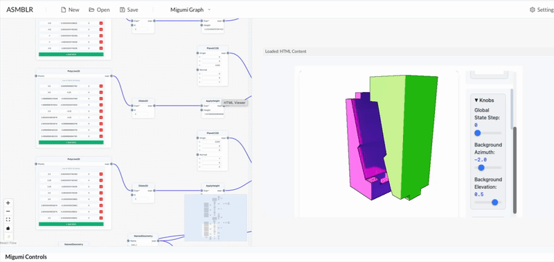
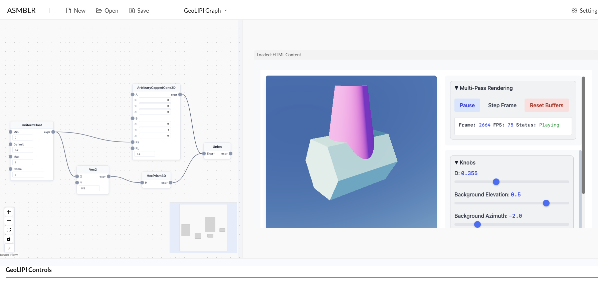
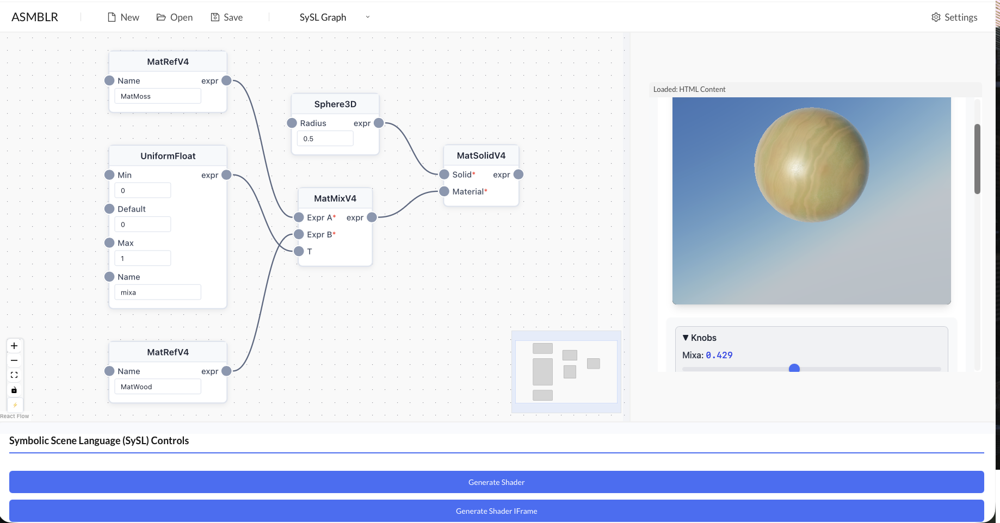

# ASMBLR Frontend

> A visual node-based shader editor for creating and editing procedural graphics

<p align="center">
  
</p>

ASMBLR Frontend is a React-based visual programming interface for creating shaders through intuitive node graphs. It's part of the **ASMBLR** ecosystem—connecting a node-based editor to backend shader generation via [GeoLiPI](https://github.com/bardofcodes/geolipi), [SySL](../sysl/), and [Migumi](../migumi/).

---

## Architecture

```
┌──────────────────────────────────────────────────────────────────────────┐
│                           ASMBLR Frontend                                │
│  ┌─────────────────────────────┐    ┌─────────────────────────────────┐  │
│  │   React Flow Node Editor    │    │     Shader Visualizer           │  │
│  │   • Visual node creation    │    │     • Real-time preview         │  │
│  │   • Connection management   │    │     • Uniform controls          │  │
│  │   • Project save/load       │    │     • HTML/iframe rendering     │  │
│  └─────────────────────────────┘    └─────────────────────────────────┘  │
└────────────────────────────────────────┬─────────────────────────────────┘
                                         │ Node Graph
                                         ▼
┌──────────────────────────────────────────────────────────────────────────┐
│                           ASMBLR Backend                                 │
│  ┌─────────────────────────────────────────────────────────────────────┐ │
│  │            GeoLiPI / SySL / Migumi Expression Engine                │ │
│  │            Converts node graphs → GLSL shader code                  │ │
│  └─────────────────────────────────────────────────────────────────────┘ │
└──────────────────────────────────────────────────────────────────────────┘
```

---

## Installation

### Prerequisites

Install the core libraries:

```bash

# geolipi
git clone git@github.com:BardOfCodes/geolipi.git
# Install or add to PYTHONPATH
cd geolipi && pip install -e .

# SySL
git git@github.com:BardOfCodes/sysl.git
# Install or add to PYTHONPATH
cd sysl && pip install -e .

# MiGumi
git clone git@github.com:BardOfCodes/migumi.git
# Install or add to PYTHONPATH
cd migumi && pip install -e .

# ASMBLR
git clone git@github.com:BardOfCodes/asmblr.git
# Install or add to PYTHONPATH
cd asmblr && pip install -e .

## Backend
git clone https://github.com/BardOfCodes/asmblr_backend
# Install or add to PYTHONPATH
cd asmblr && pip install -e .

```

### Setup

```bash
# Install dependencies
yarn install

# Start development server
yarn dev
```

The application will be available at `http://localhost:5173`

To use the system we also need to run the backend.
```bash
cd asmblr_backend
python scripts/app.py
``` 
The backend will be available at `http://localhost:5000`

---

## Usage

### Keyboard Shortcuts

| Shortcut | Action |
|----------|--------|
| `Cmd/Ctrl + G` | Open node search window |
| `Cmd/Ctrl + Enter` | Generate shader from graph |
| `Cmd/Ctrl + S` | Save project |
| `Cmd/Ctrl + O` | Open project |

### Working with Projects

- **New Project**: Use the navbar menu to create a new project
- **Save/Load**: Projects are saved as JSON files
- **Export**: Export your shader code for use elsewhere

---

## Supported Modes

### Migumi (3D Joinery)

<p align="center">
  
</p>

Create tight-fitting 3D joints and assemblies with procedural geometry.

**Loading MXG Graphs**: Pre-built graphs are available in [migumi-dataset](https://huggingface.co/datasets/bardofcodes/migumi-dataset). Find them in `joints/<name>/polyline_files/base.json` and load via File → Open.

### GeoLiPI (2D/3D Primitives)

<p align="center">
  
</p>

Build constructive solid geometry with boolean operations and transforms.

### SySL (Shader Language)

<p align="center">
  
</p>

Create Geometry + material graphs.

---

## Development

### Building the Node Library

Since GeoLiPI, SySL, and Migumi undergo changes, node definitions are auto-generated:

```bash
# In the asmblr repository
python generate_nodes.py --force
python scripts/asmblr_frontend_json.py --out nodes.json

# In this repository
yarn gen:nodes
# Or manually:
python scripts/generate_nodes_from_json.py --input <asmblr-repo>/nodes.json
```

### Scripts

```bash
yarn dev          # Start development server
yarn build        # Build for production
yarn test         # Run tests
yarn test:ui      # Run tests with UI
yarn lint         # Lint codebase
```

### Project Structure

```
src/
├── components/
│   ├── editors/          # Node editor implementations
│   │   └── reactflow_editor/  # React Flow based editor
│   ├── control-panel/    # Mode-specific control panels
│   ├── visualizer/       # Shader preview components
│   └── layout/           # Layout components
├── modes/                # Mode configurations (GeoLiPI, SySL, Migumi)
├── store/                # App state management
└── utils/                # Utility functions
```

---

## Settings

In the Settings panel, you can configure:

- **Shader Settings**: Parameters used by SySL for shader code generation
- **Editor Preferences**: Theme, layout, and interaction settings
- **Viewer Options**: Preview resolution and rendering options

---

## Context

This frontend is a rebuilt version of editors developed for:

- [Pattern Analogies](https://bardofcodes.github.io/patterns/) - Learning to perform programmatic image edits by analogy
- [MiGumi](https://bardofcodes.github.io/migumi/) - Making tightly coupled integral joints millable

---

## Citation

If you use this in your research, please cite:

```bibtex
@misc{ganeshan2025patterns,
    title={Pattern Analogies: Learning to Perform Programmatic Image Edits by Analogy}, 
    author={Aditya Ganeshan and Thibault Groueix and Paul Guerrero 
            and Radomír Měch and Matthew Fisher and Daniel Ritchie},
    booktitle={Proceedings of the IEEE/CVF Conference on 
               Computer Vision and Pattern Recognition (CVPR)},
    month={June},
    year={2025},
}

@article{ganeshan2025migumi,
    author={Ganeshan, Aditya and Fleischer, Kurt and Jakob, Wenzel 
            and Shamir, Ariel and Ritchie, Daniel and Igarashi, Takeo 
            and Larsson, Maria},
    title={MiGumi: Making Tightly Coupled Integral Joints Millable},
    year={2025},
    publisher={Association for Computing Machinery},
    volume={44},
    number={6},
    url={https://doi.org/10.1145/3763304},
    doi={10.1145/3763304},
    journal={ACM Trans. Graph.},
    articleno={193},
}
```

---

## Notes

⚠️ **Research Code**: This is research software—use at your own risk. The system may have bugs.

---

## License

MIT
